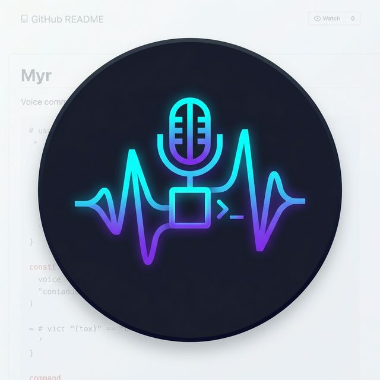

<p align="center">
  
</p>

<h1 align="center">Myr</h1>

<p align="center">
  <em>Hyprland-focused voice command CLI &amp; daemon</em>
</p>

---

Myr captures voice locally, sends audio or text plus window context to a voice API endpoint, and executes returned window-management DSL commands.

## Features

- **Push-to-talk** — daemon socket flow (`VOICE_START`, `VOICE_STOP`, `VOICE_TOGGLE`).
- **Text commands** — `myr do "focus firefox"` sends `TEXT:<cmd>` directly.
- **SSH tunnel bootstrap** — auto-connects to voice API with `/health` check.
- **Hyprland integration** — local window-management command execution and desktop notifications.

## Build & Install

```bash
cargo build --release
cp target/release/myr ~/.local/bin/
```

## CLI

```
myr daemon          # start the background daemon
myr do "..."        # send a text command
myr voice-toggle    # push-to-talk toggle
```

## Environment Variables

Myr is env-only. No config files are read or written.

| Variable | Default | Description |
|----------|---------|-------------|
| `VOICE_API_KEY` | *(required)* | API key sent as `x-api-key` to voice API |
| `SAGA_API_KEY` | *(fallback)* | Backward-compatible fallback if `VOICE_API_KEY` is unset |
| `SAGA_API_URL` | `http://localhost:${MYR_LOCAL_PORT}` | Base URL for API client |
| `SAGA_HOST` | — | SSH jump host for tunnel |
| `SAGA_VOICE_IP` | — | Voice API private IP reached through tunnel |
| `SAGA_VOICE_PORT` | `8765` | Voice API port |
| `MYR_LOCAL_PORT` | `18765` | Local tunnel bind port |
| `MYR_SOCKET` | `$XDG_RUNTIME_DIR/myr.sock` | Daemon socket override |

## Hyprland Keybind

```
bind = SUPER, V, exec, myr voice-toggle
```

## Protocol

- Daemon accepts: `VOICE_START`, `VOICE_STOP`, `VOICE_TOGGLE`, `TEXT:<cmd>`, `PING`
- API client uses: `POST /command` (multipart) and `GET /health`
- `x-api-key` header always attached
- Response accepts either `commands` or `text`
